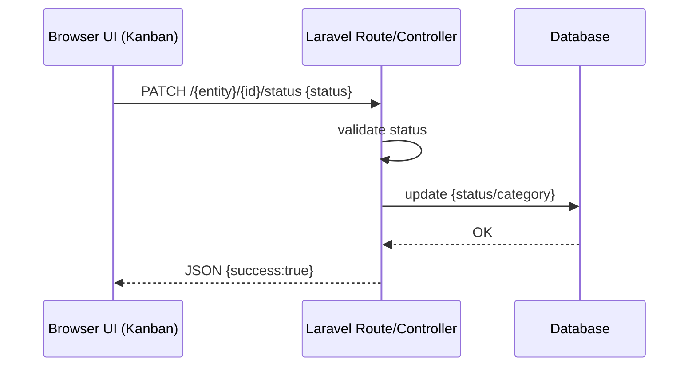

# Flowcharts

These flowcharts focus on runtime behavior (request lifecycle and the main workflows).

## Request Lifecycle (Web)

```mermaid
flowchart TD
  R[Incoming HTTP request] --> MW[Middleware: web\nSetTheme, SetLocale, TenantMiddleware]
  MW --> A{Authenticated?}
  A -->|No| G[Guest routes\n/login]
  A -->|Yes| T[TenantMiddleware\nset session company_id\ntrial/subscription check]
  T --> S{Trial expired\nand no active subscription?}
  S -->|Yes| E[403 view:\nerrors/subscription_expired]
  S -->|No| C[Controller action]
  C --> P[Policy authorizeResource]
  P --> Q[Eloquent query]
  Q --> GS[Global scopes\nTenantScope (+ HierarchicalScope)]
  GS --> DB[(Database)]
  DB --> V[View / Redirect / JSON]
```

## Super Admin: Company Setup

```mermaid
flowchart TD
  SA[Super Admin] --> IDX[/super-admin/companies\n(index)]
  IDX --> NEW[/super-admin/companies/create\n(form)]
  NEW -->|POST| STORE[CompanyController@store\nCreate Company]
  STORE --> CDB[(companies)]
  STORE --> SHOW[/super-admin/companies/{company}\n(details)]

  SHOW -->|POST subscription| SUB[CompanyController@updateSubscription\nDeactivate old, create new]
  SUB --> SDB[(company_subscriptions)]
  SUB --> SHOW

  SHOW -->|POST user| U[CompanyController@storeUser\nCreate user + assign role]
  U --> UDB[(users)]
  U --> RDB[(roles/permissions)]
  U --> SHOW
```

## Limits on Create (POST)

Routes like `POST /clients`, `POST /contacts`, `POST /deals`, `POST /users` use `EnforceLimit`.

```mermaid
flowchart TD
  POST[POST create request] --> LIM[Middleware: EnforceLimit(limit_key)]
  LIM --> CNT[Count current records\n(User/Client/Contact/Deal)]
  CNT --> FG[FeatureGate::checkLimit\n(plan limits or trial)]
  FG --> OK{Allowed?}
  OK -->|No| BACK[Back with error:\nplan limit reached]
  OK -->|Yes| CTR[Controller@store]
  CTR --> DB[(Database)]
  DB --> RED[Redirect + success]
```

## Kanban Status Update (AJAX)



